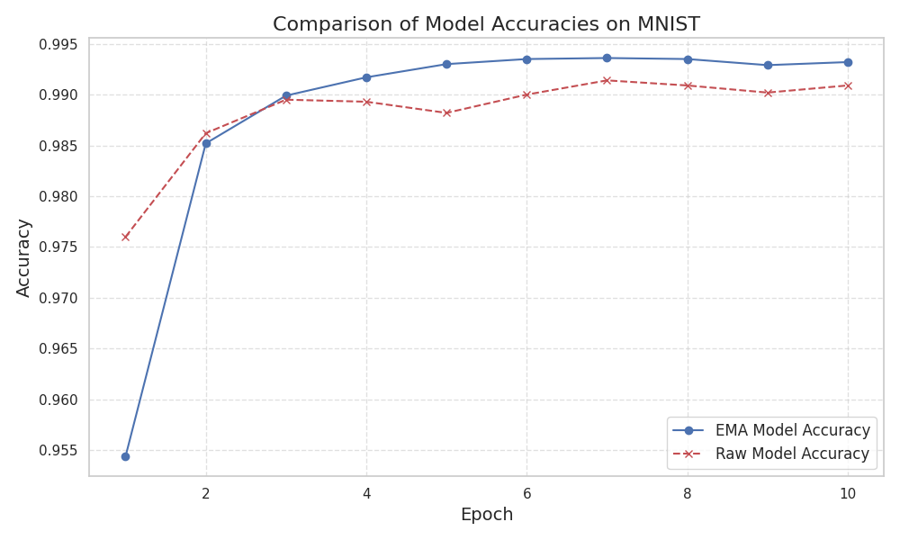
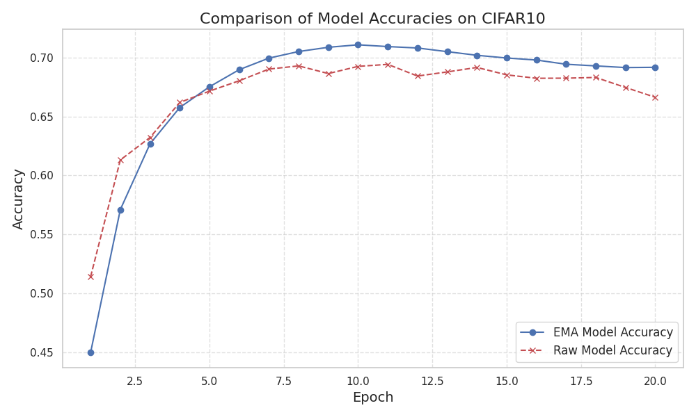

# Simple Exponential Moving Average(simple_ema) for PyTorch

A simple exponential moving average class to update the model according to 
$$
\theta_{t} = \beta\cdot \theta_{t-1} + (1-\beta)\cdot \theta_{t}
$$

NOTE. The version not only supports for the **parameter EMA** but it also supports the **buffer EMA**, if you register some buffer during the training, the **EMA can also update the buffer in its current version**.

## Usage:
1. Create a PyTorch model
2. Create the EMAModel, you can specify the hyper-parameter $\beta$ and the position of the EMA model(CPU/GPU) for saving memory.  
3. Whenever you need a EMA update, just call the **update(model)** to update the model.
4. When you need to inference with the EMA model, call **ema_inference(data)** to get the output.

## Comparison with/without EMA

### MNIST

### CIFAR10

